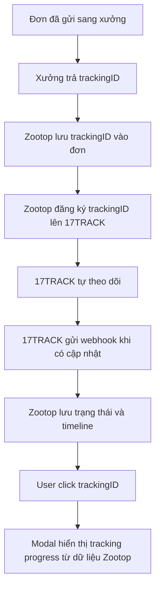

# Task 06 - Điều tra 17TRACK API - khách đã chốt không làm

## Mục tiêu

Điều tra 17TRACK API, giá quota và khả năng hiển thị modal tracking trong hệ thống Zootop Bear.

Kết luận sau confirm khách: không làm chức năng tracking/modal 17TRACK trong Phase 1.

Ý tưởng ban đầu đã được loại khỏi scope:

```text
Seller/Admin/Vận hành click trackingID
-> mở modal
-> xem tiến trình vận chuyển của đơn hàng
```

Chức năng này dùng để thay/giảm thao tác phải mở tracking thủ công trên carrier hoặc nền tảng xưởng.

## Nguồn public đã đọc

- 17TRACK API Docs: https://api.17track.net/en/doc
- 17TRACK Pricing: https://www.17track.com/en/pricing
- 17TRACK API Plan Details: https://help.17track.net/hc/en-us/articles/37575217580825-Plan-Details

## Kết luận kỹ thuật nếu sau này mở lại

Nếu sau này khách đổi ý và muốn làm lại, với hệ thống Zootop Bear nên dùng tab/gói **API** của 17TRACK, không phải gói **Order Tracking**.

Lý do:

- Zootop Bear muốn tự hiển thị modal tracking trong hệ thống.
- TrackingID được lấy từ các xưởng/nền tảng khác rồi đưa vào hệ thống Zootop.
- Hệ thống cần đăng ký trackingID lên 17TRACK API, nhận update và lưu vào database.
- Khi user click trackingID, modal chỉ đọc dữ liệu đã lưu trong database Zootop.

## Quyết định sau confirm khách

Khách đã chốt bỏ chức năng tracking/modal 17TRACK khỏi Phase 1.

Vì vậy phần 17TRACK chỉ giữ lại trong task này như hồ sơ điều tra chi phí/API, không gắn vào use case/màn hình hệ thống nữa:

- Đã gỡ use case dùng chung `UC-TRK-01 - Xem tracking progress bằng 17TRACK`.
- Đã gỡ màn `SCR-17 - Modal tracking 17TRACK` khỏi `screens.html`.
- `SCR-06 - Chi tiết đơn / mã vận đơn` chỉ còn phạm vi hiển thị trạng thái đơn, hãng vận chuyển và mã vận đơn cơ bản.
- Các role Seller, Vận hành, CSKH, Admin không có thao tác mở modal 17TRACK trong Phase 1.

Không nên gọi real-time 17TRACK mỗi lần click trackingID vì:

- Có thể chậm.
- Có thể tốn quota theo mỗi lần gọi real-time.
- Khó kiểm soát chi phí nếu seller click nhiều lần.

## Giá API public đang thấy

Tab API pricing trên 17TRACK:

| Gói API | Quota | Giá | Đơn giá |
| --- | ---: | ---: | ---: |
| Basic | 5,000 quota | 119 USD | 0.0238 USD/tracking |
| Advanced | 25,000 quota | 569 USD | 0.0227 USD/tracking |
| Pro | 150,000 quota | 2,869 USD | 0.0191 USD/tracking |
| Flagship | 500,000 quota | 9,299 USD | 0.0185 USD/tracking |

Lưu ý:

- Đây là API quota, không phải subscription unlimited.
- 1 tracking number đăng ký thành công = trừ 1 quota.
- Sau khi đăng ký thành công, 17TRACK tự theo dõi tiếp, không trừ quota lặp lại cho việc automatic update.
- Quota có hạn 12 tháng từ ngày mua.
- Quota không tự mua lại hằng tháng; cần mua plan/quota khi cần.

## Ước tính theo quy mô Zootop Bear

Thông tin scale đang hiểu:

- Hiện tại: khoảng 5,000 - 7,000 tracking/tháng.
- Cao điểm: có thể lên khoảng 30,000 tracking/tháng.

Ước tính hiện tại:

| Nhu cầu | Quota/năm | Phương án | Chi phí tham khảo |
| --- | ---: | --- | ---: |
| 5,000 tracking/tháng | 60,000 quota/năm | 3 gói Advanced = 75,000 quota | 1,707 USD/năm |
| 7,000 tracking/tháng | 84,000 quota/năm | 4 gói Advanced = 100,000 quota | 2,276 USD/năm |
| Dư dả hơn cho scale hiện tại | 150,000 quota/năm | 1 gói Pro | 2,869 USD/năm |
| Cao điểm dài hạn 30,000/tháng | 360,000 quota/năm | Pro nhiều lần hoặc Flagship | cần tính lại/đàm phán |

Gợi ý báo khách:

```text
Với quy mô hiện tại 5,000-7,000 tracking/tháng, nên dự trù gói API khoảng 100,000-150,000 quota/năm.
Chi phí tham khảo khoảng 2,276-2,869 USD/năm.
Nếu cao điểm 30,000 tracking/tháng kéo dài nhiều tháng, cần tính gói lớn hơn hoặc hỏi sales 17TRACK.
```

## API chính cần dùng

Base URL:

```text
https://api.17track.net/track/v2.4
```

Các endpoint chính:

| Mục đích | Endpoint | Ghi chú |
| --- | --- | --- |
| Xem quota còn lại | `POST /getquota` | Dùng để cảnh báo sắp hết quota |
| Đăng ký tracking | `POST /register` | Gọi khi Zootop nhận trackingID mới từ xưởng |
| Lấy thông tin tracking | `POST /gettrackinfo` | Dùng để sync lại khi cần |
| Lấy thông tin real-time | `POST /getRealTimeTrackInfo` | Không dùng mặc định khi user click |
| Webhook | URL do Zootop cung cấp | 17TRACK đẩy update về Zootop |

Header bắt buộc:

```text
17token: SecurityKey
Content-Type: application/json
```

Giới hạn kỹ thuật public:

- Request dùng HTTP POST.
- Request/response dạng JSON UTF-8.
- Mỗi request tối đa 40 tracking numbers.
- Rate limit thông thường: 3 request/giây.
- 17TRACK tự check trạng thái khoảng 6-12 giờ tùy trạng thái.
- Delivered/Exception thường check khoảng 24 giờ.

## Flow tích hợp đề xuất

```text
1. Zootop tạo/gửi đơn sang xưởng
2. Xưởng xử lý đơn
3. Xưởng trả trackingID/carrier về Zootop
4. Zootop lưu trackingID vào đơn hàng
5. Zootop đăng ký trackingID lên 17TRACK API
6. 17TRACK bắt đầu tự theo dõi
7. 17TRACK gửi update về Zootop qua webhook
8. Zootop lưu trạng thái/timeline mới nhất
9. Seller/Admin/Vận hành click trackingID
10. Zootop mở modal hiển thị tracking progress từ database
```

Mermaid:



## Dữ liệu cần lưu trong Zootop

Gợi ý bảng/field nghiệp vụ:

```text
order_id
seller_id
supplier_code
supplier_order_id
tracking_number
carrier_code
carrier_name
tracking_registered_at
tracking_register_status
tracking_current_status
tracking_seller_status
tracking_last_event_at
tracking_last_sync_at
tracking_raw_payload
```

Timeline events:

```text
tracking_number
event_time
event_location
event_description
event_status
source = 17TRACK / supplier / internal
raw_event
```

## Mapping trạng thái gợi ý

| 17TRACK status | Zootop internal status | Seller thấy |
| --- | --- | --- |
| NotFound | tracking_pending | Đang chờ hãng vận chuyển cập nhật |
| InfoReceived | tracking_info_received | Hãng vận chuyển đã nhận thông tin |
| InTransit | in_transit | Đang vận chuyển |
| Delivered | delivered | Đã giao hàng |
| Exception | delivery_exception | Cần hỗ trợ giao hàng |
| Expired | tracking_expired | Quá lâu chưa có cập nhật |

## Modal tracking từng dự kiến - đã hủy khỏi scope

Nếu sau này mở lại chức năng, modal từng dự kiến sẽ hiển thị:

- Tracking number.
- Carrier.
- Trạng thái hiện tại dễ hiểu.
- Thời gian cập nhật mới nhất.
- Timeline các mốc vận chuyển.
- Link mở trang tracking ngoài nếu cần.
- Nút refresh thủ công chỉ nên cho Admin/Vận hành, không nên cho seller bấm tự do.

## Use case đã loại khỏi scope

Mã use case từng đề xuất nhưng đã gỡ khỏi hệ thống:

```text
UC-TRK-01 - Xem tracking progress bằng 17TRACK
```

Trạng thái: đã hủy khỏi Phase 1, không còn gắn vào hệ thống.

Role từng dự kiến sử dụng nếu làm:

- Seller: xem tracking của đơn mình.
- CSKH: xem tracking để hỗ trợ seller.
- Vận hành: xem tracking và xử lý đơn bất thường.
- Admin: xem toàn bộ.

## Câu hỏi draft đã hủy

Các câu hỏi dưới đây không cần hỏi khách nữa vì khách đã chốt không làm chức năng tracking/modal 17TRACK trong Phase 1:

- Khách có đồng ý dùng 17TRACK API theo mô hình mua quota theo trackingID không?
- Với quy mô hiện tại, khách muốn dự trù 100,000 quota/năm hay 150,000 quota/năm?
- Seller có được bấm refresh tracking thủ công không, hay chỉ Admin/Vận hành được refresh?
- Modal tracking cần hiển thị tiếng Việt hay giữ nguyên mô tả tiếng Anh từ carrier/17TRACK?
- Có cần gửi email cho seller khi tracking chuyển sang Delivered/Exception không?
- Tracking đã delivered sau bao lâu thì không cần tiếp tục sync nữa?

## File HTML trực quan

- Đã xóa `tracking-modal-flow.html` vì chức năng tracking/modal 17TRACK không còn nằm trong scope hệ thống.
